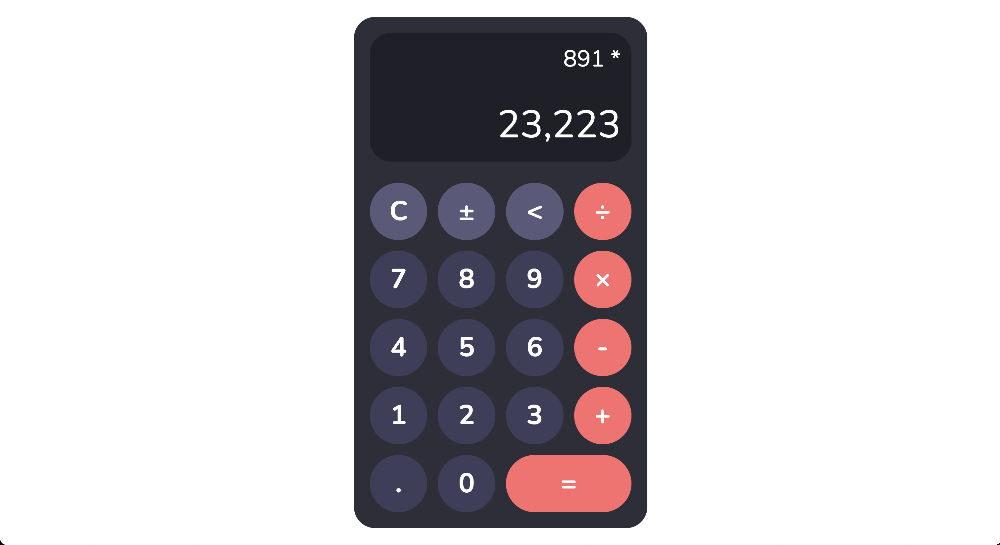

# NuCalc Pro - A Modern Web Calculator

A sleek, modern, and powerful web-based calculator with PWA support. NuCalc Pro (“NuCalc”) brings a responsive, touch-friendly interface, keyboard integration, and installable offline functionality to your browser.

<p align="center">
  
  
  
  
  
  
  
  
  
  
</p>

**Live Web App:** [https://nucalc-app.vercel.app/](https://nucalc-app.vercel.app/).

<p align="center">
  
</p>

---

## Features

- **Basic arithmetic**: add, subtract, multiply, divide
- **Chain operations**: e.g. `2 + 3 × 4`
- **Decimal support** with proper formatting
- **Sign toggle** & **backspace**
- **Keyboard shortcuts** for all buttons
- **Responsive layout** with fluid sizing based on viewport
- **Touch-friendly buttons** with hover/press animations
- **PWA support** (installable, offline-capable)
- **Modern theme** with customizable color variables

---

## Tech Stack

- **TypeScript** (\~5.6.2)
- **Vite** (^6.0.3)
- **Vitest** (^2.1.8) for testing
- **Prettier** (^3.5.3) for code formatting
- **HTML5** for markup (`index.html`)
- **CSS3** with custom theme (`styles.css`, `/themes/cocoa.css`)
- **Intl API** for number formatting
- **Service Worker & manifest.json** for PWA

---

## Project Structure

```
/
├── index.html              # Main HTML page
├── manifest.json           # PWA manifest
├── img/
│   ├── favicon.ico
│   └── icons/
│       ├── icon-192x192.png
│       └── icon-512x512.png
├── src/
│   ├── main.ts             # Entry point: wiring DOM ↔ Calculator logic
│   ├── calculator.ts       # Calculator class implementation
│   ├── operation.ts        # SupportedOperation enums & interface
│   └── utils.ts            # displayTextToNumber, numberToDisplayText, reformat
├── styles.css              # Base styles & layout
└── themes/
    └── cocoa.css           # Color overrides for Cocoa theme
```

---

## Installation & Usage

1. **Clone the repo**

   ```bash
   git clone https://github.com/hoangsonww/NuCalc-Calculator-App.git
   cd NuCalc-Calculator-App
   ```

2. **Install dependencies**

   ```bash
   npm install
   ```

3. **Available Scripts**

   ```json
   {
     "scripts": {
       "dev": "vite",
       "build": "tsc && vite build",
       "preview": "vite preview",
       "test": "vitest run",
       "format": "prettier --write \"**/*.{ts,tsx,js,jsx,json,css,scss,md,html}\""
     },
     "devDependencies": {
       "typescript": "~5.6.2",
       "vite": "^6.0.3",
       "vitest": "^2.1.8"
     },
     "dependencies": {
       "prettier": "^3.5.3"
     }
   }
   ```

4. **Run in development mode**

   ```bash
   npm run dev
   ```

   - Opens a local server (e.g. `http://localhost:3000`) with live reload.

5. **Build for production**

   ```bash
   npm run build
   ```

   - Output is placed in `dist/`. Deploy those files to your static hosting.

6. **Preview production build**

   ```bash
   npm run preview
   ```

7. **Run tests**

   ```bash
   npm run test
   ```

8. **Format code**

   ```bash
   npm run format
   ```

9. **Install PWA**

   - Visit the site in Chrome/Edge/Safari (mobile or desktop).
   - Click “Install” in the address bar or system prompt.
   - Enjoy offline support!

---

## Development

- **Calculator logic** lives in `src/calculator.ts`. All tests for edge cases (decimal entry, chaining, backspace) should be added there.
- **Operations** are defined in `src/operation.ts`. Extend `SupportedOperation` and update `selectOperation()` if you add new operators.
- **Styling** is scoped to CSS variables in `themes/cocoa.css`—override to create new color schemes without touching layout.
- **Keyboard handling** is in `src/main.ts`; add new shortcuts by listening on `document.keydown`.
- **Tests** live alongside source files with `.spec.ts` naming. Run via Vitest.

---

## Customization

- **Themes**: Copy `themes/cocoa.css` → `themes/<your-theme>.css`, update five CSS variables:

  ```css
  #calculator {
    background-color: /* bg */;
  }
  .calculator-display-row {
    background-color: /* display bg */;
  }
  .calculator-button {
    background-color: /* digit bg */;
  }
  .system-button {
    background-color: /* sys bg */;
  }
  .operation-button {
    background-color: /* op bg */;
  }
  ```

- **Fonts**: Change the Google Fonts link in the `<head>` of `index.html`.
- **Icons**: Replace `img/icons/icon-*.png` to update PWA icon sets.

---

## Sample Ruby on Rails API

This project includes a sample Ruby on Rails API for demonstration purposes. The API is not fully functional and is provided as a reference for integrating with a backend service.

To run the API, follow these steps:

1. Ensure you have Ruby and Rails installed on your machine.

2. Navigate to the `api` directory:

   ```bash
   cd api
   ```
   
3. Install the required gems:

   ```bash
    bundle install
    ```
   
4. Start the Rails server:

    ```bash
    rails server
    ```
   
5. The API will be available at `http://localhost:3000`.

6. You can test the API endpoints using tools like Postman or cURL.

7. The API is a simple RESTful service that can be used to demonstrate how to integrate with a backend service.

---

## Contributing

1. Fork the repo
2. Create a feature branch (`git checkout -b feature/my-feature`)
3. Commit your changes (`git commit -m "Add my feature"`)
4. Push to your fork (`git push origin feature/my-feature`)
5. Open a Pull Request

Please follow the existing code style and add tests for new functionality.

---

## License

Distributed under the MIT License. See [LICENSE](LICENSE) for details.

---

## Acknowledgements

Big thanks to Prof. Ajay Gandecha at UNC-Chapel Hill for the inspiration and base structure of this project. This calculator would not be possible without the foundational work done in his course.
